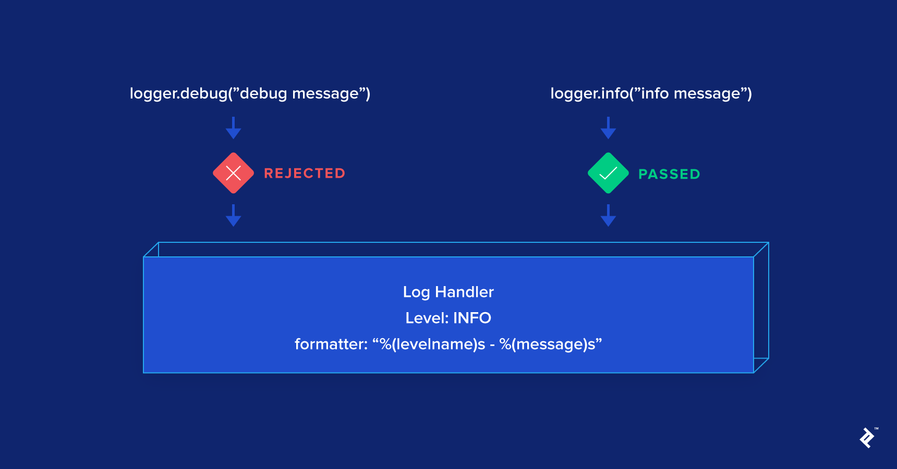

# Logger

- There are six levels for logging in Python & each level is associated with an integer that indicates the log severity:
  - `NOTSET=0`
  - `DEBUG=10`
  - `INFO=20`
  - `WARN=30`
  - `ERROR=40`
  - `CRITICAL=50`
  <p align="center"></p>

## Logger hierarchy

### Root Logger

- Changing the `basicConfig` of the root logger will also affect the log events of the other (lower) loggers in the hierarchy.

```Python
import logging
# config for root logger
logging.basicConfig(level=logging.INFO, format='%(name)s - %(levelname)s - %(message)s')
logging.info("This is info from root logger")
```

### Custom Logger with Handler

- Sample logger class: [MyLogger](./utils/__init__.py)
- Logger is probably the one that will be used directly the most often in the code and which is also the most complicated. A new logger can be obtained by `logger = logging.getLogger(__name__)`
- The log handler is the component that effectively writes/displays a log: Display it in the console (via `StreamHandler`), in a file (via `FileHandler`), or even by sending you an email via `SMTPHandler`, etc.
- A logger has three main fields:
  - `propagate` Decides whether a log should be propagated to the logger’s parent. By default, its value is True.
  - `level` Like the log handler level, the logger level is used to filter out “less important” logs. Except, unlike the log handler, the level is only checked at the “child” logger; once the log is propagated to its parents, the level will not be checked. This is rather an un-intuitive behavior.
  - `handlers` The list of handlers that a log will be sent to when it arrives to a logger. This allows a flexible log handling—for example, you can have a file log handler that logs all DEBUG logs and an email log handler that will only be used for CRITICAL logs. In this regard, the logger-handler relationship is similar to a publisher-consumer one: A log will be broadcast to all handlers once it passes the logger level check.

## Best practice

- Configure the root logger but never use it in your code—e.g., never call a function like `logging.info()`, which actually calls the **root logger** behind the scenes.
- To use the logging, make sure to create a new logger by using `logging.getLogger(logger name)`
  - In your application with multiple modules is to create an internal logger using the `__name__` global variable (`logger = logging.getLogger(__name__)`).
  - This will create a logger with the name of your module and ensures no name collisions.

## Logging Tips

- Trace back error with ` logger.exception(f"Cannot divide x={x} with y={y}")`
